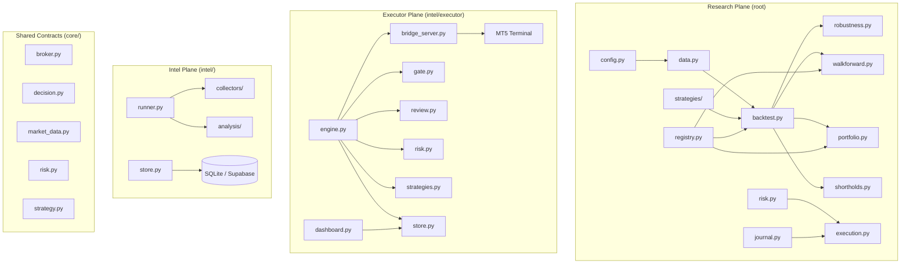
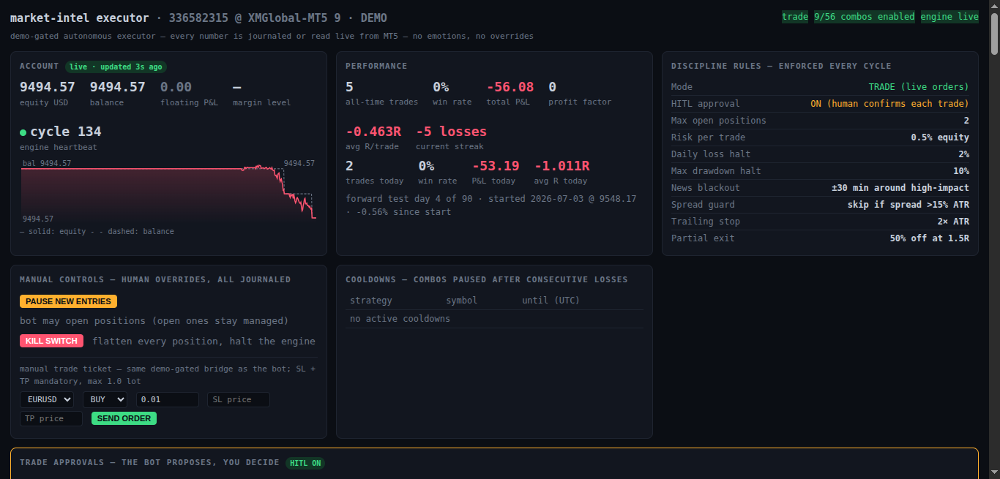
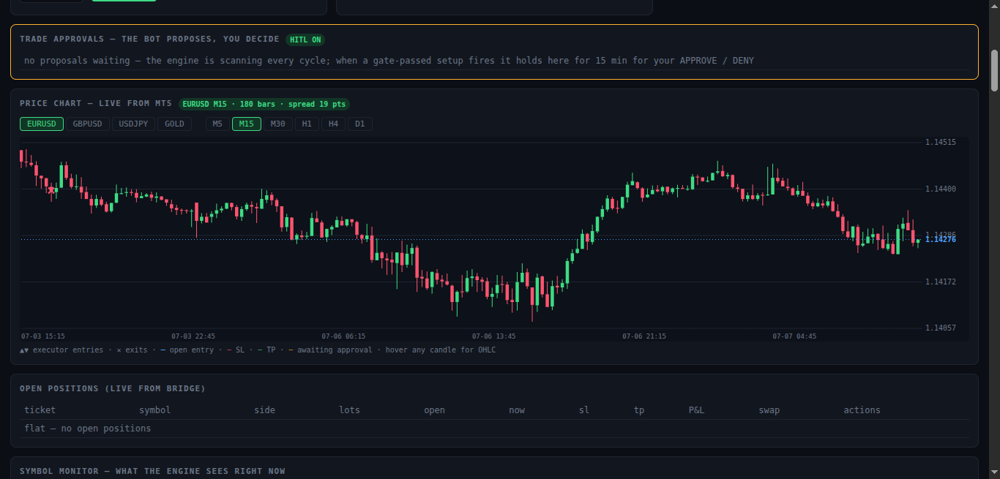
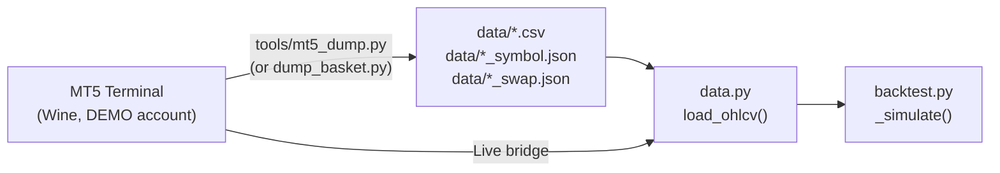

# 📋 Full Repository Documentation — `mt5-research`

> **Kalahari Labs · market-intel executor + research harness**
> Audit date: 2026-07-07 · **193/193 tests passing** ✅

---

## Install — one command

```bash
curl -fsSL https://raw.githubusercontent.com/Kalahari-Labs/mt5-research/main/bootstrap.sh | bash
```

That clones the repo, verifies Python ≥ 3.10 + numpy (the **only** runtime
dependency), runs the full 193-test suite on your machine, seeds `intel/.env`,
and prints platform-specific next steps for connecting MT5. It will **not**
enable live trading — that is structurally impossible without the
[triple gate](#safety-model). Detailed guides:

| Platform | Guide |
|---|---|
| **Windows** (easiest) | [intel/docs/INSTALL-WINDOWS.md](intel/docs/INSTALL-WINDOWS.md) |
| **Linux** (Wine bridge) | [intel/docs/INSTALL-WINE-MT5.md](intel/docs/INSTALL-WINE-MT5.md) |
| **Raspberry Pi** | [intel/docs/INSTALL-RASPBERRY-PI.md](intel/docs/INSTALL-RASPBERRY-PI.md) |

Then: `cd intel && python3 -m executor.run` and open the dashboard at
`http://127.0.0.1:8877`.

---

## Website & contributing

The project site — architecture, safety model, and the honest research
verdicts — lives in [`/web`](web/) and deploys to Vercel. Want to contribute
code, a new strategy brief, or a bug fix? Start with
[CONTRIBUTING.md](CONTRIBUTING.md) for branch rules, test discipline, and the
research-registry workflow.

---

## Table of Contents

1. [What This Is](#what-this-is)
2. [Architecture Overview](#architecture-overview)
3. [The Two Planes](#the-two-planes)
4. [Module-by-Module Breakdown](#module-by-module-breakdown)
5. [Strategies](#strategies)
6. [The 6-Phase Research Journey](#the-6-phase-research-journey)
7. [Dashboard — The Control Room](#dashboard--the-control-room)
7. [Cost & Fill Model](#cost--fill-model)
8. [Data Pipeline](#data-pipeline)
9. [Safety Model](#safety-model)
10. [Configuration Reference](#configuration-reference)
11. [Test Suite Results](#test-suite-results)
12. [Deployment Options](#deployment-options)
13. [Codebase Stats](#codebase-stats)

---

## What This Is

An **autonomous, demo-gated MT5 trading executor** and its underlying **research harness** — the disciplined laboratory that proved most naive strategies fail, and built the gate that prevents unprofitable ones from ever trading.

### Core Philosophy
- **Nothing trades until it passes an out-of-sample backtest gate** on real broker data
- Every entry has a server-enforced SL+TP
- Every decision — including every skip — is journaled
- Every closed trade gets a data-checked post-mortem
- The system's own research found 29/29 momentum configs failed walk-forward under real costs — the gate exists **because** of that

### Key Numbers
- **~11,000 lines** of Python across 30+ modules
- **193 unit tests**, all passing
- **7,177 D1 bars** of EURUSD data (euro-era 1999→2026, ~27.5 years)
- **4 research strategies** + **10 executor strategies**
- **Zero external dependencies** beyond `numpy` + stdlib — the dashboard
  chart is self-contained SVG/JS, no CDN, no chart API key

---

## Architecture Overview



---

## The Two Planes

### 1. Research Plane (repo root)

The **backtest / walk-forward / robustness laboratory**. Deterministic, rule-based, LLM-free. Produces the verdicts that the executor's gate enforces.

| Component | Description |
|---|---|
| Backtesting engine | Strategy-agnostic, vectorised numpy engine with realistic cost model |
| Robustness scanner | Parameter surface sweeps → SPIKE / PLATEAU / NO-EDGE verdicts |
| Walk-forward validation | Rolling IS/OOS folds, no-peeking, continuous OOS equity curve |
| Portfolio layer | Cross-asset inverse-vol weighted, common window alignment, portfolio WF |
| Short-hold analysis | Phase 5: H4 hold-time vs financing decomposition with kill criterion |

### 2. Executor Plane (`intel/executor/`)

The **autonomous trading loop** — demo-gated, self-auditing, 24/7. Built on top of the intel plane's read-only market intelligence.

| Component | Description |
|---|---|
| Engine | 30-second loop: reconcile → manage → decide → order |
| Bridge | Wine-side HTTP server — the ONLY file that calls `order_send` |
| Gate | OOS backtest on 5,000 fresh broker bars per strategy×symbol |
| Risk | 0.5% sizing, 2% daily halt, 10% drawdown halt, news blackout |
| Review | Post-mortem on every closed trade, auto-disable losing combos |
| Dashboard | `http://127.0.0.1:8877` — live candlestick chart (bars straight from MT5, entries/SL/TP/trade markers drawn from the journal), positions, decision feed, gate status |
| HITL | `MI_HITL_MODE=1` — every proposed trade waits on the dashboard for a human APPROVE/DENY (15-min TTL, then auto-expires; stale quotes can never fire) |

---

## Module-by-Module Breakdown

### Research Core (Root)

| Module | Lines | Responsibility |
|---|--:|---|
| [config.py](file:///home/flowdaaddy/mt5-research/config.py) | 316 | Single source of truth. 8 frozen dataclasses (`StrategyConfig`, `RiskConfig`, `BacktestConfig`, `CostModel`, `WalkForwardConfig`, `ExecutionConfig`, `JournalConfig`). Every param overridable via `.env`. Per-instrument cost table (`INSTRUMENT_COSTS`). `cost_for()` factory builds realistic cost models per symbol. |
| [data.py](file:///home/flowdaaddy/mt5-research/data.py) | 124 | OHLCV provider. Tries live MT5 → falls back to cached CSV from Wine bridge. Returns `OHLCV` dataclass with numpy arrays. Symbol specs from JSON. |
| [backtest.py](file:///home/flowdaaddy/mt5-research/backtest.py) | 406 | Strategy-agnostic simulation engine. `_simulate()` is the core loop: next-bar-open fills (no look-ahead), full cost accounting (spread, commission, slippage, swap), mark-to-market equity curve. `run()` is the high-level API. Includes legacy-vs-realistic comparison, look-ahead audit, and verdict printer. |
| [risk.py](file:///home/flowdaaddy/mt5-research/risk.py) | 150 | **THE ONLY module allowed to approve an order.** Position sizing = `(balance × risk%) ÷ (stop_distance ÷ tick_size × tick_value)`, floored to lot step. Enforces: kill switch, daily loss cap, max open positions, per-trade risk budget, daily loss budget. Zero I/O — pure arithmetic. |
| [execution.py](file:///home/flowdaaddy/mt5-research/execution.py) | 208 | Demo-only order path. OFF by default, dry-run by default. 5-layer safety: risk gate → account DEMO check → disabled/dry-run filter → send with filling-mode retry → verify broker retcode. **No code path can place a real-money order.** |
| [journal.py](file:///home/flowdaaddy/mt5-research/journal.py) | 95 | Append-only event log. SQLite by default, Supabase if configured. Records every signal, decision, rejection, and fill with UTC timestamp. |
| [registry.py](file:///home/flowdaaddy/mt5-research/registry.py) | 158 | Results registry over SQLite. Logs every backtest/robustness/WF run with content hash (dedup detection). Tracks **multiple-testing count**: distinct strategy+param configs ever evaluated OOS. CLI: `list [N]`, `count`. |
| [robustness.py](file:///home/flowdaaddy/mt5-research/robustness.py) | 251 | Parameter surface sweep. Full strategy param grid × full history with realistic costs. Text heatmap + SPIKE/PLATEAU/NO-EDGE verdict via connected-component analysis of the profitable region. In-sample only (shape, not validation). |
| [walkforward.py](file:///home/flowdaaddy/mt5-research/walkforward.py) | 368 | Rolling walk-forward OOS validation. Strategy-agnostic: grid-searches each strategy's `wf_grid()` per IS window, applies best to strictly-following OOS window. OOS segments chained into continuous curve. Handles naive-average-vs-pooled bias warning. |
| [portfolio.py](file:///home/flowdaaddy/mt5-research/portfolio.py) | 556 | Cross-asset portfolio layer. Fixed-param momentum sleeves, inverse-vol equal-risk weighting, common-window alignment, sleeve correlation matrix, portfolio walk-forward with causal IS weight re-estimation. 7-instrument basket (5 kept, 2 dropped for insufficient history). |
| [shortholds.py](file:///home/flowdaaddy/mt5-research/shortholds.py) | 495 | Phase 5: H4 short-hold momentum analysis. 3 a-priori configs (C1/C2/C3), kill criterion before completeness, 3-stack cost decomposition (gross → +trading → +swap = net), directional swap model, H4 robustness surface. |
| [strategy.py](file:///home/flowdaaddy/mt5-research/strategy.py) | ~12 | DEPRECATED shim re-exporting SMA pieces. Use `strategies/`. |

---

### Strategies Package (`strategies/`)

| Module | Lines | Description |
|---|--:|---|
| [base.py](file:///home/flowdaaddy/mt5-research/strategies/base.py) | 62 | `Strategy` contract + `Signals` dataclass. Pure: `generate(close, **params) → Signals`. Optional hooks: `param_grid()`, `wf_grid()`, `warmup_bars()`, `validate_params()`. |
| [sma_crossover.py](file:///home/flowdaaddy/mt5-research/strategies/sma_crossover.py) | 61 | SMA fast/slow crossover. +1 when fast>slow, -1 when fast<slow. Numpy rolling mean (exact). 10×9 param grid for robustness sweeps. |
| [ts_momentum.py](file:///home/flowdaaddy/mt5-research/strategies/ts_momentum.py) | 189 | Moskowitz-Ooi-Pedersen TSMOM. Core: `position = sign(trailing_return[lookback])`. Trend-confirmation filter (EMA anchor, ON by default). Volatility entry filter (OFF by default). Recursive causal EMA. 9×6 robustness grid, 5×3 WF grid. |
| [buy_and_hold.py](file:///home/flowdaaddy/mt5-research/strategies/buy_and_hold.py) | 22 | Trivial placeholder. Always long, no params. |
| [\_\_init\_\_.py](file:///home/flowdaaddy/mt5-research/strategies/__init__.py) | 39 | Strategy registry. `register()` / `get()` / `all_names()`. Adding a strategy = 1 file + 1 registration line. |

---

### Core Contracts Package (`core/`)

Shared, dependency-free `@runtime_checkable` Protocols for cross-subsystem convergence:

| Protocol | Purpose |
|---|---|
| `BrokerAdapter` | Read/write broker operations (orders, positions, account) |
| `MarketDataProvider` | OHLCV + tick data access |
| `RiskManager` | Position sizing + veto decisions |
| `Strategy` | `decide(bars, i)` with SL+TP |
| `Decision` / `Action` | Typed decision records |

---

### Executor Components (`intel/executor/`)

| Module | Lines | Description |
|---|--:|---|
| [engine.py](file:///home/flowdaaddy/mt5-research/intel/executor/engine.py) | ~18K | Main 30-second loop. Reconcile broker-closed trades, time-stop/Friday-flat management, strategy decisions, risk vetoes, order submission. |
| [bridge_server.py](file:///home/flowdaaddy/mt5-research/intel/executor/bridge_server.py) | ~14K | Wine-side HTTP server (`:8787`). The ONLY file that calls `order_send`. Re-verifies DEMO per order, refuses orders without SL+TP, hard volume cap. |
| [strategies.py](file:///home/flowdaaddy/mt5-research/intel/executor/strategies.py) | ~24K | 10 registered strategies (trend, breakout, mean reversion, ICT, session, scalping). |
| [gate.py](file:///home/flowdaaddy/mt5-research/intel/executor/gate.py) | ~8K | OOS backtest on 5,000 fresh broker bars per strategy×symbol. Must be profitable OOS + in ≥2/3 time slices. |
| [review.py](file:///home/flowdaaddy/mt5-research/intel/executor/review.py) | ~11K | Post-mortem on every closed trade. Pattern detection (stop-too-tight, against-H4-trend, etc.). Cooldown/disable logic. |
| [risk.py](file:///home/flowdaaddy/mt5-research/intel/executor/risk.py) | ~6K | 0.5% risk sizing, 2% daily halt, 10% drawdown halt, news blackout ±30min. |
| [dashboard.py](file:///home/flowdaaddy/mt5-research/intel/executor/dashboard.py) | ~17K | Live web dashboard on `:8877`. Real-time candlestick chart with SL/TP/entry overlays, account, positions, HITL approvals, decision feed, gate status. |
| [store.py](file:///home/flowdaaddy/mt5-research/intel/executor/store.py) | ~8K | SQLite persistence for trades, decisions, lessons, equity snapshots. |
| [config.py](file:///home/flowdaaddy/mt5-research/intel/executor/config.py) | ~7K | Executor-specific configuration. All env-var driven. |
| [notify.py](file:///home/flowdaaddy/mt5-research/intel/executor/notify.py) | ~3K | Phone notifications via ntfy.sh or Telegram. Fire-and-forget. |
| [onboard.py](file:///home/flowdaaddy/mt5-research/intel/executor/onboard.py) | ~7K | Live-probes every prerequisite, tells you what to fix. |

---

### Tools (`tools/`)

| Script | Description |
|---|---|
| [mt5_dump.py](file:///home/flowdaaddy/mt5-research/tools/mt5_dump.py) | Wine-side one-shot data dumper. Fetches OHLCV from MT5, writes CSV + symbol JSON + account JSON. |
| [dump_basket.py](file:///home/flowdaaddy/mt5-research/tools/dump_basket.py) | Basket dumper with case-sensitive symbol matching, hidden-symbol selection, downward depth probing. |
| [dump_h4.py](file:///home/flowdaaddy/mt5-research/tools/dump_h4.py) | H4 bars + swap spec dumper. Captures `swap_long`/`swap_short`/`swap_mode` from `symbol_info()`. |
| [demo_roundtrip.py](file:///home/flowdaaddy/mt5-research/tools/demo_roundtrip.py) | End-to-end demo fill test through the bridge. |

---

## Strategies

### Research Strategies (4)

| Strategy | Signal | Default TF | Params | Verdict |
|---|---|---|---|---|
| **SMA Crossover** | Fast SMA > Slow SMA → long; < → short | H1 | fast=20, slow=50 | ❌ NO EDGE on H1 after costs. Walk-forward OOS negative. |
| **TS Momentum** | Sign of trailing lookback-period return, with EMA anchor filter | D1 | lookback=120, anchor=200 | ⚠️ Thin: OOS +34.5% over 24yr, but Sharpe 0.2, maxDD -26.5%. Swap kills it. |
| **Carry Momentum** | TSMOM signal filtered/blended by directional overnight swap (carry) | D1 | filter X∈{0,50,100}bps, composite λ∈{0.25,0.5} | ❌ Best pre-registered config: pooled OOS Sharpe 0.28 vs the 0.5 gate — GATE NOT MET ([PHASE6.md](PHASE6.md)) |
| **Buy & Hold** | Always long | — | none | Trivial placeholder |

### Executor Strategies (10)

| Strategy | Idea | TF |
|---|---|---|
| `trend_pullback` | EMA20/50 trend + RSI pullback resolution | H1 |
| `donchian_breakout` | Channel breakout w/ ATR expansion + trend agreement | H1 |
| `meanrev_bb` | Fade Bollinger extremes in flat regimes only | H1 |
| `fvg_retrace` | ICT fair value gap retrace into unfilled 3-candle imbalance | H1 |
| `liquidity_sweep` | ICT stop hunt: fade failed sweep of N-bar high/low | H1 |
| `orderblock_retest` | ICT order block: first retest after displacement break | H1 |
| `london_breakout` | Asian-range breakout in London window | H1 |
| `momentum_macd` | MACD histogram flip with EMA200 regime | H1 |
| `rsi2_meanrev` | Connors RSI(2) flush back to EMA20 mean, with-trend | H1 |
| `scalp_ema_cross` | Session scalper, EMA9/21 cross, tight ATR stops | M15 |

---

## The 6-Phase Research Journey


### Phase 0 — SMA Crossover Baseline
- SMA(20/50) on EURUSD H1 (15,000 bars)
- Result: **−12.18%** total return, PF 0.812
- Negative, but the engine works correctly

### Phase 1 — Realistic Cost Audit
- Added explicit spread (0.8p), slippage (0.2p), per-lot commission (3.5)
- Original −12.18% was **OPTIMISTIC** → realistic = **−13.04%** (Δ −0.86 pts)
- Full audit documented in [FILL_MODEL.md](file:///home/flowdaaddy/mt5-research/FILL_MODEL.md)

### Phase 2 — Robustness + Walk-Forward
- **Robustness:** SMA → NO EDGE across 90-cell grid (all negative after costs)
- **Walk-forward:** OOS confirms: negative, as expected

### Phase 3 — Time-Series Momentum (D1)
- TSMOM on EURUSD D1, 7,177 bars (1999→2026)
- **Robustness: PLATEAU** — 54/54 cells profitable (PF 1.25–1.36)
- **Walk-forward (25 folds, 24yr continuous OOS):**
  - +34.5% total, PF 1.18, maxDD −26.5%, 267 trades
  - Annualised OOS ≈ +1.25%/yr at Sharpe ~0.2
  - **Real but thin** — not a green light

### Phase 4 — Cross-Asset Portfolio
- 5 instruments (EURUSD, GBPUSD, USDJPY, AUDUSD, GOLD)
- Inverse-vol equal-risk weighting, common window 2011→2026
- Sleeve correlations low (mean +0.20); diversification reduces maxDD
- **But with ~1.5–4%/yr swap drag, every sleeve is net-negative post-swap**
- Portfolio ann: **−1.19%**, Sharpe **−0.20**
- **Verdict: NOT retail-tradeable as built**

### Phase 5 — Short-Hold H4
- Question: can faster cycling outrun financing?
- **Kill criterion fired:** extra execution cost > swap savings
- Turnover scales faster than swap savings — the hypothesis fails
- **Gate: NOT MET**

### Phase 6 — Carry-Aware Momentum
- Question left open between 4 and 5: make the **signal** swap-aware instead
  of changing the holding period
- 5 pre-registered configs (carry filter X∈{0,50,100}bps; composite λ∈{0.25,0.5}),
  every one logged to the multiple-testing counter **before** any run
- Best: filter X=0bps — net pooled **OOS Sharpe 0.28** (ann +1.14%) vs the 0.5 gate
- **Gate: NOT MET** — full honesty in [PHASE6.md](PHASE6.md); registry count
  now 34 OOS-evaluated configs, none passing

---

## Dashboard — The Control Room

`http://127.0.0.1:8877` — served by stdlib `http.server`, self-contained
JS/SVG, zero CDN, zero chart API. Every number is a row the engine journaled
to SQLite or a live read from the MT5 bridge; the dashboard computes nothing
and invents nothing.



**Live price chart** — real candles straight from your broker feed (M5→D1,
all configured symbols), with the executor's life drawn on top: entry lines,
SL/TP levels, ▲▼ entry markers and ✕ exits — hover any marker and the tooltip
tells you the strategy and *why* it entered (the journaled signal).



**Human-in-the-loop (`MI_HITL_MODE=1`)** — the bot stops firing and starts
*proposing*. Each proposal holds in the amber approvals panel with the full
case: strategy, confluence stars, regime, spread context, SL/TP, and a live
expiry countdown (default 15 min, `MI_HITL_TTL_MIN`). You click **APPROVE**
or **DENY**. Expired or already-acted proposals can never be resurrected —
a stale quote can never reach the bridge.

**Manual controls — all journaled, all demo-gated server-side:**

| Control | What it does |
|---|---|
| PAUSE / RESUME | Stops new entries (`manual_halt`, enforced by the risk veto every cycle); open positions stay managed |
| KILL SWITCH | Flattens every position and halts the engine (touches the `KILL` file) |
| CLOSE (per position) | Market-close one ticket; refused if the ticket isn't actually open |
| Manual trade ticket | **Opt-in, off by default** (`MI_MANUAL_TICKET=1`). Human order through the **same demo-gated bridge** as the bot: whitelisted symbols only, max 1.0 lot, SL + TP mandatory — no stop, no order. Default posture: the human approves, the bot enters |

---

## Cost & Fill Model

### The `CostModel` Dataclass

| Parameter | Default | Description |
|---|---|---|
| `spread_pips` | 0.8 | Round-trip bid/ask width in pips |
| `commission_per_lot` | 3.5 | Account currency, per 1.0 lot, per side |
| `slippage_pips` | 0.2 | Adverse fill per side |
| `fill_timing` | `next_open` | Realistic; `close` = look-ahead (audit only) |
| `pip_size` | 0.0001 | EURUSD: 1 pip = 0.0001 |
| `contract_size` | 100,000 | EURUSD: 1.0 lot = 100k units |
| `swap_rate_annual` | 0.0 | Symmetric financing drag (Phase 4) |
| `swap_model` | `symmetric` | `symmetric` (Phase 4) or `directional` (Phase 4b) |
| `swap_long_per_night` | 0.0 | Directional: price units/unit/night when LONG |
| `swap_short_per_night` | 0.0 | Directional: price units/unit/night when SHORT |
| `swap_triple_weekday` | 2 (Wed) | Python weekday charged 3× for T+2 settlement |

### Per-Instrument Costs

| Instrument | Pip Size | Spread | Slip | Comm/Lot | Contract | Swap %/yr |
|---|---|---|---|---|---|---|
| EURUSD | 1e-4 | 0.8 | 0.2 | 3.5 | 100K | 2.0% |
| GBPUSD | 1e-4 | 1.2 | 0.3 | 3.5 | 100K | 2.0% |
| USDJPY | 1e-2 | 1.0 | 0.3 | 3.5 | 100K | 1.5% |
| AUDUSD | 1e-4 | 1.0 | 0.3 | 3.5 | 100K | 2.5% |
| GOLD | 1e-2 | 25.0 | 8.0 | 0.0 | 100 | 4.0% |
| US500Cash | 1e-1 | 5.0 | 2.0 | 0.0 | 1 | 5.0% |
| OILCash | 1e-2 | 3.0 | 1.0 | 0.0 | 100 | 6.0% |

---

## Data Pipeline

### Available Data Files

| File | Bars | Range | Size |
|---|--:|---|--:|
| `EURUSD_1440.csv` (D1) | 7,177 | 1999→2026 | 468 KB |
| `EURUSD_60.csv` (H1) | 15,000 | — | 967 KB |
| `EURUSD_240.csv` (H4) | — | — | 1.3 MB |
| `GBPUSD_1440.csv` | 5,000 | 2007→ | 354 KB |
| `USDJPY_1440.csv` | 5,000 | 2007→ | 313 KB |
| `AUDUSD_1440.csv` | 4,000 | 2011→ | 256 KB |
| `GOLD_1440.csv` | 6,519 | 2001→ | 401 KB |
| `US500Cash_1440.csv` | 700 | — | 45 KB |
| `OILCash_1440.csv` | 1,200 | — | 66 KB |

Plus H4 (`_240.csv`) data for 5 instruments, swap JSONs, symbol specs, and `account.json`.

### Data Flow



---

## Safety Model

### Research Plane Safety

| Protection | Description |
|---|---|
| Demo-only execution | `execution.py` hard-refuses non-DEMO accounts (checked twice) |
| Off by default | `EXECUTION_ENABLED=false`, `DRY_RUN=true` |
| Risk gate | `risk.py` is the single approval authority |
| Kill switch | `_manual_kill` flag halts everything |
| Daily loss cap | 3% of day-start balance |
| Max open positions | 1 (configurable) |

### Executor Plane Safety (9 Layers)

| Layer | Rule | Location |
|---|---|---|
| 1 | Writes refused unless account is DEMO | `bridge_server.py` |
| 2 | Orders without SL AND TP refused | `bridge_server.py` |
| 3 | Volume > 0.50 lots refused | `bridge_server.py` |
| 4 | Live: triple unlock required | `bridge_server.py` |
| 5 | Must pass OOS backtest gate | `gate.py` |
| 6 | 0.5% risk, 2% daily halt, 10% DD halt | `risk.py` |
| 7 | News blackout ±30 min | `risk.py` |
| 8 | Cooldown after 3 losses; disable after 5/7d | `review.py` |
| 9 | `touch executor/data/KILL` → flatten all | `engine.py` |

---

## Configuration Reference

### Environment Variables (`.env`)

| Variable | Default | Purpose |
|---|---|---|
| `STRATEGY_NAME` | `sma_crossover` | Active research strategy |
| `SYMBOL` | `EURUSD` | Trading symbol |
| `TIMEFRAME_MIN` | `60` | Timeframe (60=H1, 240=H4, 1440=D1) |
| `SMA_FAST` / `SMA_SLOW` | 20 / 50 | SMA params |
| `MOM_LOOKBACK` / `MOM_ANCHOR` | 120 / 200 | TSMOM params |
| `RISK_PER_TRADE_PCT` | 1.0 | % of balance risked per trade |
| `MAX_DAILY_LOSS_PCT` | 3.0 | Daily loss halt threshold |
| `SPREAD_PIPS` | 0.8 | **Set to YOUR broker's spread** |
| `COMMISSION_PER_LOT` | 3.5 | Per-lot commission (per side) |
| `FILL_TIMING` | `next_open` | Realistic fill timing |
| `WF_IS_BARS` / `WF_OOS_BARS` | 3000 / 500 | Walk-forward window sizes |
| `EXECUTION_ENABLED` | `false` | Must be true to send orders |
| `DRY_RUN` | `true` | Must be false to actually send |

---

## Test Suite Results

```
Ran 193 tests in ~36s — OK ✅
```

### Test Coverage by Module

| Test File | Tests | What's Covered |
|---|--:|---|
| `test_risk.py` | 11 | Position sizing, max-risk cap, daily loss cap, kill switch, open positions |
| `test_hitl.py` | 11 | HITL proposal TTL, expiry sweep (approve-after-expiry race), no resurrection of expired/executed proposals |
| `test_chart_api.py` | 12 | Chart param validation (symbol/tf whitelists, count clamp), overlay filtering, bridge-down degradation |
| `test_controls_api.py` | 14 | Pause/resume/kill journaling, close-position guards, manual-ticket discipline (symbol whitelist, 1.0-lot cap, mandatory SL/TP) |
| `test_phase6.py` | 24 | Carry math vs hand oracle, truncation invariance (no look-ahead), flat-when-carry-adverse, symmetric-swap path untouched, regression guards |
| `test_execution.py` | ~12 | Live refusal, dry-run default, no-send, every safety branch |
| `test_costs.py` | ~8 | Spread/slippage/commission math, fill_price, CostModel fields |
| `test_walkforward.py` | 7 | Fold splitter (no look-ahead), OOS-strictly-after-IS, window sizes, grid filtering |
| `test_strategies.py` | 7 | Strategy contract, registry (register/get/unknown), SMA refactor guard, buy-and-hold |
| `test_momentum.py` | 13 | Signal vs numpy oracle, truncation invariance (no look-ahead), trend/vol filters, WF generalisation |
| `test_portfolio.py` | 14 | Swap math, hash stability, swap-reduces-PnL guard, inverse-vol equal-risk, alignment, portfolio WF OOS-after-IS, regression guard (SMA + single-EURUSD exact numbers) |
| `test_registry.py` | 6 | Log/list round-trip, duplicate detection, multiple-testing counter dedup |
| `test_core_contracts.py` | ~10 | Protocol compliance for all core contracts |
| `test_phase5.py` | 14 | Directional swap math, holding periods, swap spec loading, triple-swap day, H4 alignment, symmetric path untouched guard |

### Key Guards

- **SMA refactor guard**: Registered SMA reproduces exact prior numbers bit-for-bit
- **Truncation invariance**: `regime[:t]` never depends on future data (look-ahead proof)
- **Momentum registration guard**: Adding TSMOM left SMA's walk-forward search byte-for-byte unchanged
- **Regression guard**: SMA + single-EURUSD momentum reproduce exact prior numbers
- **Phase 4 swap guard**: Swap strictly reduces P&L, never changes the signal
- **Equal-risk guard**: No sleeve > 1.5× median risk contribution (synthetic AND real basket)
- **Hash stability**: Cost dict hashes are stable across runs (registry dedup reliability)

---

## Deployment Options

| Platform | Guide | Method |
|---|---|---|
| **Windows** (easiest) | `intel/docs/INSTALL-WINDOWS.md` | Native MT5 + Python |
| **Linux** | `intel/docs/INSTALL-WINE-MT5.md` | Wine bridge |
| **macOS** | See Windows doc's macOS note | Wine or remote bridge |
| **Raspberry Pi** | `intel/docs/INSTALL-RASPBERRY-PI.md` | Engine on Pi, bridge elsewhere |
| **Docker** | `docker compose up -d` | Container for engine+dashboard |

### Quick Start

```bash
git clone https://github.com/Kalahari-Labs/mt5-research && cd mt5-research
./run.sh check     # probes every prerequisite
./run.sh gate      # backtest gate on YOUR broker's data
./run.sh observe   # watch it think — zero orders
./run.sh           # autonomous (demo-gated always)
```

---

## Codebase Stats

| Metric | Value |
|---|---|
| Total Python lines | ~10,450 |
| Python modules | 30+ |
| Test files | 10 |
| Test cases | 193 |
| Data files | 28 (CSVs, JSONs, SQLite) |
| Documentation files | 8 (README, FILL_MODEL, ROBUSTNESS, WALKFORWARD, PORTFOLIO, SHORTHOLDS, GUIDE, EXECUTOR) |
| Research strategies | 3 |
| Executor strategies | 10 |
| Minimum Python version | 3.10 |
| Required runtime deps | 1 (`numpy>=1.24`) |
| Test runtime deps | 0 (stdlib `unittest`) |

---

## Key Honest Verdicts

> [!IMPORTANT]
> **The system's own research found most simple strategies lose after real costs.** The gate exists because of that finding, not despite it.

| Research Phase | Verdict |
|---|---|
| SMA Crossover (H1) | ❌ **NO EDGE** — negative in-sample and out-of-sample after costs |
| TS Momentum (D1, single) | ⚠️ **REAL BUT THIN** — survives walk-forward but Sharpe ~0.2, annualised ~1.25%/yr |
| Portfolio (D1, 5 instruments) | ❌ **SWAP KILLS IT** — every sleeve net-negative post-financing |
| Short-Hold H4 | ❌ **TURNOVER > SAVINGS** — execution costs scale faster than swap savings |
| Executor gate (XM demo) | ⚠️ **2 of 12 combos enabled** — the system refuses to trade most things |

> [!TIP]
> **The gate refusing to trade is the feature, not a bug.** A system that honestly tells you "no edge found" after 27 years of data and 193 tests is more valuable than one that pretends otherwise.
