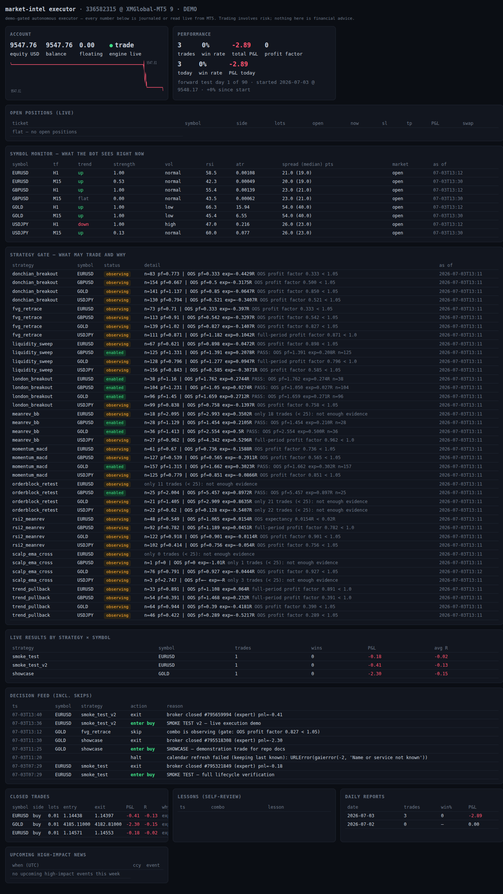
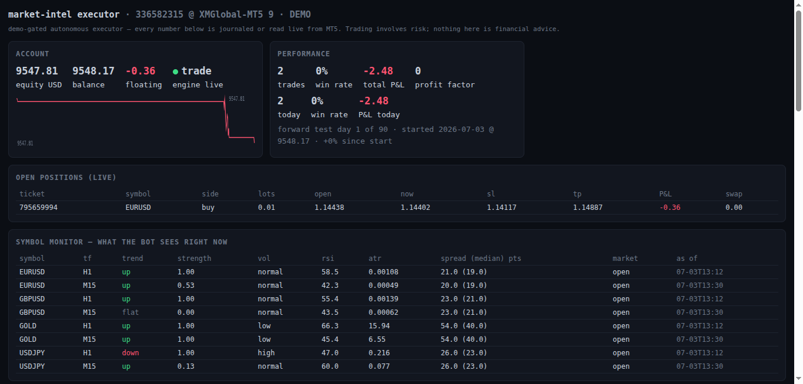

# mt5-research — market-intel executor + research harness

An **autonomous, demo-gated MT5 trading executor** plus the research harness
that keeps it honest. Ten rule-based strategies (trend, breakout, mean
reversion, ICT fair-value-gap / liquidity-sweep / order-block, session
breakout, scalping) run behind one contract: **nothing trades until it passes
an out-of-sample backtest gate on your broker's own data**, every entry has a
server-enforced SL+TP, every decision — including every skip — is journaled,
and every closed trade gets a data-checked post-mortem the bot builds
protections from.

> ⚠️ **Risk disclosure — read this first.** This software places real orders
> on whatever account the attached MT5 terminal is logged into. It ships
> **locked to demo accounts** (re-verified server-side before every single
> order). Trading leveraged products can lose more than you expect, fast.
> Backtests and demo results do **not** imply live profits. This repo's own
> research found most simple strategies lose after real costs — the gate
> exists because of that. Nothing here is financial advice. If you
> deliberately unlock a live account, every loss is yours alone.

## Live showcase (real demo account, real numbers)



A live position with its server-side SL/TP, floating P&L straight from MT5:



## Quick start — one command

| platform | guide |
|---|---|
| **Windows** (native, easiest) | [intel/docs/INSTALL-WINDOWS.md](intel/docs/INSTALL-WINDOWS.md) |
| **Linux** (Wine bridge) | [intel/docs/INSTALL-WINE-MT5.md](intel/docs/INSTALL-WINE-MT5.md) |
| **macOS** (Wine or remote bridge) | see the Windows doc's macOS note |
| **Raspberry Pi** (engine on the Pi, bridge elsewhere) | [intel/docs/INSTALL-RASPBERRY-PI.md](intel/docs/INSTALL-RASPBERRY-PI.md) |
| **Docker** (engine+dashboard container) | `docker compose up -d` — see [docker-compose.yml](docker-compose.yml) |

Once MT5 + a **demo** login exist, ONE script boots and supervises everything —
terminal, bridge, engine, dashboard:

```bash
git clone https://github.com/Kalahari-Labs/mt5-research && cd mt5-research
./run.sh check     # live-probes every prerequisite, tells you what to fix
./run.sh gate      # what earns the right to trade on YOUR broker's data
./run.sh observe   # watch it think — full pipeline, zero orders
./run.sh           # autonomous (demo-gated server-side, always)
```

Windows: same commands with `run.bat`. It auto-creates `intel/.env` from the
example on first run — set `MI_SYMBOLS` to your broker's symbol names.

Dashboard: http://127.0.0.1:8877 — account, live positions, what the bot sees
per symbol, the strategy gate, every decision with its reason, lessons, daily
reports. Phone notifications on entries/exits/halts: set `MI_NTFY_TOPIC`
(keyless, [ntfy.sh](https://ntfy.sh)) or a Telegram bot token in `.env`.
Emergency stop: `touch intel/executor/data/KILL` → flattens everything, halts.

Full architecture + safety model: **[intel/executor/EXECUTOR.md](intel/executor/EXECUTOR.md)**.
The 24/7 read-only intel plane (collectors, regime analysis, news):
[intel/README.md](intel/README.md).

---

## The research harness

Everything below is the **research plane** the executor grew out of: a
disciplined, demo-only backtest/walk-forward laboratory. It is deterministic
and rule-based; no LLM makes trading decisions; all risk controls live in
plain code. Its verdicts (29/29 momentum configs failed walk-forward under
real costs) are the reason the executor gates everything.

## What it is
- Two research strategies behind one contract: the **SMA crossover** baseline and
  **`ts_momentum`** — a properly-constructed time-series (trend-following) momentum
  strategy, the current subject of interest (`buy_and_hold` is a trivial placeholder).
- A backtest over **real** broker history with a clean metrics report.
- A deterministic, unit-tested risk module — the *only* thing allowed to approve
  an order.
- A demo-only execution module that is **OFF by default**, **dry-run by
  default**, and **hard-refuses any non-demo account**.
- A journal of every signal, decision, rejection, and (demo) fill.

## Module map (one responsibility each)
| file | responsibility |
|------|----------------|
| `config.py` | single source of truth — symbol, timeframe, strategy/risk/backtest/cost/walk-forward params (override via `.env`) |
| `data.py` | OHLCV provider: live MetaTrader5 if reachable, else the real cached CSV |
| `strategies/` | strategy registry + the `Strategy` contract; `sma_crossover` (baseline) + `ts_momentum` (time-series momentum, the live subject) + `buy_and_hold` (placeholder) |
| `strategy.py` | DEPRECATED shim re-exporting the SMA pieces (use `strategies/`) |
| `backtest.py` | strategy-agnostic engine; legacy-vs-realistic cost audit; report |
| `robustness.py` | sweeps a strategy's param grid → text heatmap + SPIKE / PLATEAU / NO-EDGE verdict |
| `walkforward.py` | rolling walk-forward / out-of-sample validation (anti-curve-fit guard) |
| `registry.py` | results registry over the SQLite DB; run log + multiple-testing counter (CLI) |
| `risk.py` | position sizing + max-risk, max-daily-loss, max-open-positions caps + kill switch |
| `execution.py` | demo-only, off-by-default order path; routes through `risk.py`; refuses live accounts |
| `journal.py` | append-only event log to SQLite (or Supabase if configured) |
| `portfolio.py` | cross-asset portfolio layer: fixed-param momentum sleeves, inverse-vol equal-risk weighting, combined curve, portfolio walk-forward |
| `tools/mt5_dump.py` | one-shot Wine-side dumper that fetches real data onto this box |
| `tools/dump_basket.py` | Wine-side basket dumper (case-sensitive symbols, hidden-symbol select, downward depth probing) for the portfolio's cross-asset D1 data |

The explicit cost model lives in `config.py` (`CostModel`, `REALISTIC_COSTS`,
`LEGACY_COSTS`, per-instrument `INSTRUMENT_COSTS` incl. overnight swap). Audit /
robustness / validation / portfolio write **`FILL_MODEL.md`**, **`ROBUSTNESS.md`**,
**`WALKFORWARD.md`**, **`PORTFOLIO.md`**.

## Add a new strategy (one file + one line)
1. Add `strategies/my_strategy.py` implementing the `Strategy` contract
   (`generate(close, **params) -> Signals`; optionally `default_params` /
   `param_grid`). Pure — signals in, nothing else.
2. Add one line to `strategies/__init__.py`: `register(MyStrategy())`.

No engine or backtest changes are needed. Select it with `STRATEGY_NAME=my_strategy`
in `.env`. If your params are **not** `(fast, slow)`, also override two optional
contract hooks so the walk-forward harness stays strategy-agnostic: `wf_grid()` (the
`{param: values}` grid to search per in-sample window) and `warmup_bars(**params)`
(leading bars the signal needs, for look-ahead-free OOS seeding). Default to `None`/
largest-int, which preserves the SMA path exactly — see `ts_momentum` for a worked
non-`(fast, slow)` example.

## Environment note (important)
This was built on a Linux machine where:
1. the official **`MetaTrader5` package cannot import** (it is Windows-only), and
2. **PyPI is unreachable**, so `pandas` / `pandas-ta` / `backtesting.py` / `pytest`
   cannot be installed.

So, exactly as the brief allows for the data layer, the code runs on **numpy +
the standard library**:
- **Real data** is pulled through the existing **Wine MT5 bridge** by
  `tools/mt5_dump.py` and cached. SMA uses `data/EURUSD_60.csv` (15,000 H1 bars);
  `ts_momentum` uses `data/EURUSD_1440.csv` (**7,177 D1 bars, euro-era 1999→2026**).
  Both are EURUSD, XMGlobal-MT5 **demo** account `336582315`; `data.py` reads the
  cache keyed by `SYMBOL`/`TIMEFRAME_MIN`. (The broker serves D1 back to 1988, but
  pre-1999 "EURUSD" is a synthetic pre-euro reconstruction, kept out of the honest
  test as `data/EURUSD_1440_full_1988.csv`.)
- Indicators use numpy (`pandas-ta` substitute — a rolling mean is exact anyway).
- The backtest uses a small, transparent numpy engine in `backtest.py` (the
  `backtesting.py` substitute) with the same metric vocabulary and a strict
  next-bar-open fill (no look-ahead).
- Tests use the stdlib `unittest` runner (the `pytest` substitute), so they run
  with **zero installs**.

`requirements.txt` lists the canonical stack; on a networked machine
`pip install -r requirements.txt` makes those the drop-in engines without changing
the module boundaries.

## Run the backtest / cost audit
```bash
cd ~/mt5-research
python3 backtest.py
```
Prints the **legacy-vs-realistic** cost comparison side by side, a look-ahead
sanity check, and the verdict on the original number, then logs to the registry.
Costs are configurable in `config.py` / `.env` (`SPREAD_PIPS`,
`COMMISSION_PER_LOT`, `SLIPPAGE_PIPS`, `FILL_TIMING`). The realistic model is the
default; **set the spread/commission to your broker's real figures** before
trusting absolute returns. Full write-up: `FILL_MODEL.md`.

## Run the robustness report (overfit detector)
```bash
cd ~/mt5-research
python3 robustness.py
```
Sweeps the strategy's whole param grid over the full history and prints a text
heatmap of the result surface plus a one-line verdict:
- **PLATEAU** — broad contiguous profitable region (small param changes don't break
  it): more likely real.
- **SPIKE** — profit isolated to one lucky setting, losing neighbours: **curve-fit
  warning**.
- **NO EDGE** — nothing profitable in-sample (the common, honest result).

Writes `ROBUSTNESS.md`. This is an in-sample sensitivity scan (shape, not
validation); the walk-forward is the out-of-sample test.

## Run the walk-forward (out-of-sample validation)
```bash
cd ~/mt5-research
python3 walkforward.py
```
Rolling, non-anchored folds (default ~6-month in-sample / ~1-month out-of-sample,
config `WF_IS_BARS` / `WF_OOS_BARS` / `WF_STEP`). Strategy-agnostic: each fold
grid-searches the active strategy's `wf_grid()` params on the in-sample window only
(best profit factor, ≥ `WF_MIN_TRADES` trades) — falling back to the SMA fast/slow
grid when a strategy declares none — then applies that fixed set to the
strictly-following out-of-sample window. Every OOS segment is chained into one continuous OOS equity curve — the
honest estimate. Prints the IS-vs-OOS degradation, logs to the registry, and
prints the multiple-testing count. Writes `WALKFORWARD.md`. Expect OOS worse than
IS (and likely negative for SMA) — that is the guard working, not a failure.

## Time-series momentum on daily bars (the first real hypothesis test)
`ts_momentum` is the canonical Moskowitz-Ooi-Pedersen time-series momentum signal:
**position = sign of the trailing `MOM_LOOKBACK`-period return** (long if the
past-LOOKBACK return > 0, short/flat if < 0; default lookback 120 D1 bars ≈ 6 months).
On by default: a **trend-confirmation filter** (take a signal only when price is on
the correct side of a long EMA anchor `MOM_ANCHOR`, default 200). Off by default: a
**volatility entry filter** (skip *new* entries in an extreme trailing-vol percentile;
entry-only, never resizes). Every component is look-ahead-free (a unit test proves
regime`[:t]` never depends on the future). Sizing is the same fixed-fraction model as
SMA (vol-targeting is a deliberately separate, later enhancement).

Run the full gauntlet on **daily (D1)** bars — TSMOM's documented home, and far less
noisy than the H1 where the SMA crossover struggled:
```bash
cd ~/mt5-research
STRATEGY_NAME=ts_momentum TIMEFRAME_MIN=1440 python3 backtest.py     # realistic-cost audit
STRATEGY_NAME=ts_momentum TIMEFRAME_MIN=1440 python3 robustness.py   # SPIKE/PLATEAU/NO-EDGE
STRATEGY_NAME=ts_momentum TIMEFRAME_MIN=1440 \
  WF_IS_BARS=750 WF_OOS_BARS=250 WF_STEP=250 WF_MIN_TRADES=8 python3 walkforward.py
```
**Data / timeframe used:** EURUSD **D1, euro-era 1999-01-04 → 2026-06-29, 7,177 bars**
(~27.5 yrs). D1 was chosen over H4/H1 because that depth gives a meaningful 25-fold
walk-forward and TSMOM's edge is documented on daily+. The D1 walk-forward windows
(~3yr IS / ~1yr OOS, `WF_MIN_TRADES=8`) are sized for D1 trade frequency, not the H1
SMA defaults.

**Honest verdict — a real but thin trend edge (not a forced winner):**
- **Robustness: PLATEAU** — 54/54 lookback×anchor cells profitable in-sample
  (PF ~1.25–1.36), one contiguous block: robust to parameter choice, not a lucky
  spike (contrast SMA's NO-EDGE/negative result on H1).
- **Walk-forward (25/25 folds, ~24 yrs continuous OOS — the only curve never optimised
  on): pooled OOS +34.5%, PF 1.18, win 28.5%, maxDD −26.5%, 267 trades** — net
  **positive out-of-sample**, where SMA was negative. But it degrades hard IS→OOS
  (PF 3.78 → 1.18; maxDD −8.5% → −26.5%), only 13 of 25 OOS folds are positive, and a
  meaningful slice of the gain comes from a few low-trade-count folds. Annualised OOS
  ≈ **+1.25%/yr** at Sharpe ~0.2 — consistent with the documented single-instrument
  TSMOM premium, which is small before cross-asset diversification.

So momentum **survives** a strict walk-forward (necessary evidence of a real effect),
but it is thin, drawdown-heavy, and un-diversified — *not* a green light to trade.
Full write-ups: `ROBUSTNESS.md`, `WALKFORWARD.md`. Phase 4 (below) tested the
documented next enhancer — cross-asset diversification with honest holding costs —
and the verdict is negative.

## Phase 4 — cross-asset portfolio with honest holding costs (the gate stays shut)
```bash
cd ~/mt5-research
python3 portfolio.py          # portfolio report + walk-forward + PORTFOLIO.md + registry
```
**Question asked:** does the thin single-instrument momentum edge become tradeable
through diversification, once overnight financing (swap) is charged?
**Method (anti-overfit by construction):** ONE fixed param set from the D1 plateau
centre (lookback 120 / anchor 200 — the `ts_momentum` defaults) applied UNIFORMLY to
every instrument; no per-instrument fitting, so the multiple-testing count grows by
exactly one config. Each sleeve runs through the unchanged single-instrument engine
with realistic costs **plus a conservative constant swap drag** (`CostModel.swap_rate_annual`,
default 0 ⇒ all pre-Phase-4 numbers reproduce at identical registry content hashes;
per-instrument rates in `config.INSTRUMENT_COSTS`, documented approximations — real
swaps are directional and occasionally credits; the symmetric drag is the deliberate
worst case). Sleeves are inverse-volatility weighted (equal standalone risk
contribution — tested), aligned on their common window, and combined; the portfolio
walk-forward re-estimates the vol weights causally on each 750-bar IS window and
applies them to the strictly-following 250-bar OOS window.

**Basket actually available from the broker (XM demo):** EURUSD 7,177 D1 bars (1999→),
GBPUSD 5,000 (2007→), USDJPY 5,000 (2007→), AUDUSD 4,000 (2011→), GOLD 6,519 (2001→)
— **used** (common window 2011-03-22→2026-06-29, 3,942 bars). US500Cash (700 bars)
and OILCash (1,200 bars) — **dropped**: too little history (a short sleeve truncates
the whole common window; threshold 2,000 bars, documented in `portfolio.py`).

**Honest verdict — diversification works mechanically, but swap kills the edge:**
- Sleeve correlations are genuinely low (mean pairwise **+0.20**) and portfolio maxDD
  is shallower than single-EURUSD (−21.3% vs −24.1%): diversification does its job.
- But with a conservative ~1.5–4%/yr financing drag, **every sleeve is net-negative
  post-swap** on 2011–2026: portfolio ann **−1.19%**, Sharpe **−0.20**; single-EURUSD
  ann −1.23%, Sharpe −0.13. Pooled walk-forward OOS: **−8.05%**, Sharpe **−0.11**.
- Continuity check: single-EURUSD momentum over its full 27-yr history goes
  **+47.99% (swap off, the Phase-3 number) → −6.7% (swap on)**. The financing drag
  alone erases the whole edge — a real finding, not a bug.

**Conclusion: this momentum edge is NOT retail-tradeable as built.** Diversification
cannot rescue a per-sleeve edge that is negative after holding costs — risk parity
only makes a negative expectation more consistent. The gate to live/demo wiring
stays closed. Full write-up: `PORTFOLIO.md`.

## Results registry & multiple-testing counter
Every backtest / robustness / walk-forward run is logged to the SQLite DB
(strategy, params, costs, data range, IS+OOS metrics, timestamp, content hash —
identical re-runs are flagged `↻ DUPLICATE`). Inspect it:
```bash
python3 registry.py list [N]   # recent runs
python3 registry.py count      # distinct configs tested against OOS + luck warning
```
The **multiple-testing count** is how many distinct strategy+param configs have
ever been evaluated against out-of-sample data. The more you test, the more likely
an OOS "winner" is luck — a survivor needs a much higher bar or fresh, unseen data.

## Run the tests
```bash
cd ~/mt5-research
python3 -m unittest discover -s tests -v
```
82 tests: position sizing, max-risk / daily-loss / open-positions caps, kill
switch; every execution safety branch (live refusal, dry-run default, no-send);
the **cost model**; the **walk-forward fold splitter** (no look-ahead); the
**strategy registry + refactor guard** (registered SMA reproduces the numbers
exactly); the **results registry** round-trip + multiple-testing dedup; the
**`ts_momentum`** guards — signal vs an independent numpy oracle, truncation
invariance (proof of no look-ahead), the trend/volatility filters, and a guard that
adding momentum left SMA's walk-forward search byte-for-byte unchanged; and the
**Phase-4 portfolio** guards — swap cost math + hash stability + "swap strictly
reduces P&L, never changes the signal", the regression guard (SMA + single-EURUSD
momentum reproduce their exact prior numbers), inverse-vol equal-risk weighting
(no sleeve >1.5× the median risk contribution, synthetic AND real basket),
portfolio aggregation/alignment oracles, and OOS-strictly-after-IS for the
portfolio walk-forward.

## Refresh the real data (Wine bridge)
Requires the MT5 terminal logged into the demo account under Wine:
```bash
WINEPREFIX=$HOME/.mt5 WINEDEBUG=-all \
  wine 'C:\Program Files\Python312\python.exe' \
  'Z:\home\flowdaaddy\mt5-research\tools\mt5_dump.py' EURUSD 60 15000
```
Writes `data/<SYMBOL>_<TF>.csv`, `data/<SYMBOL>_symbol.json`, `data/account.json`.
The dumper itself asserts the account is DEMO before writing anything.

## Risk model
Position size = `(balance × risk_per_trade_pct) ÷ (stop_distance ÷ tick_size × tick_value)`,
floored to the lot step. An order is approved only if it also passes: kill switch
off, daily-loss cap not hit, open-positions cap not hit, and the sized risk fits
both the per-trade budget and the remaining daily-loss budget. `risk.py` is the
single approval gate.

## Execution safety (later, demo only)
Defaults: `EXECUTION_ENABLED=false`, `DRY_RUN=true`. To place orders on the demo
account **after** you have reviewed backtest results, set in `.env`:
```
EXECUTION_ENABLED=true
DRY_RUN=false
```
Even then, `execution.py` reads `account_info()` and **refuses** unless
`trade_mode == DEMO (0)` — twice (before building the order, and again inside the
sender). There is no code path that can place a real-money order.

## Out of scope (gated on results)
No n8n flows, no browser automation, no live trading, no second strategy, no
dashboard. Those wait until the numbers are reviewed.
