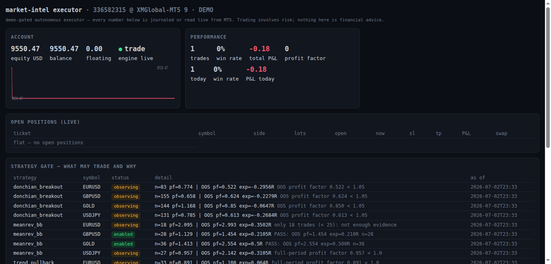

# Showcase — one full trade lifecycle, live on the dashboard

What you are watching (real demo account, XM 336582315, 2026-07-03):

| Frame | State |
|---|---|
| 1 | Flat. Engine live in trade mode; gate table shows WHY 10 of 12 combos may not trade. |
| 2 | `BUY 0.01 GOLD @ 4185.11` opens with SL 4169.59 / TP 4214.59 attached — the bridge refuses any order without both. |
| 3 | Live P&L moving with the market (−$1.74 at this frame). |
| 4 | Closed at 4182.81 → **−$2.30 (−0.15R)** booked, reconciled from broker deal history, stats updated. |

Honesty notes:

- This was a **demonstration trade** (strategy label `showcase`), placed to
  document the pipeline — not a strategy signal. It lost $2.30 and the system
  shows the loss, because the dashboard can only render what was journaled or
  read live from the broker.
- Real autonomous entries come only from gate-passed combos (green `enabled`
  rows in the gate table) and are journaled the same way, wins and losses alike.
- Individual frames: [flat](showcase/showcase-1-flat.png) ·
  [open](showcase/showcase-2-open.png) ·
  [P&L moving](showcase/showcase-3-pnl-moving.png) ·
  [closed](showcase/showcase-4-closed.png)
